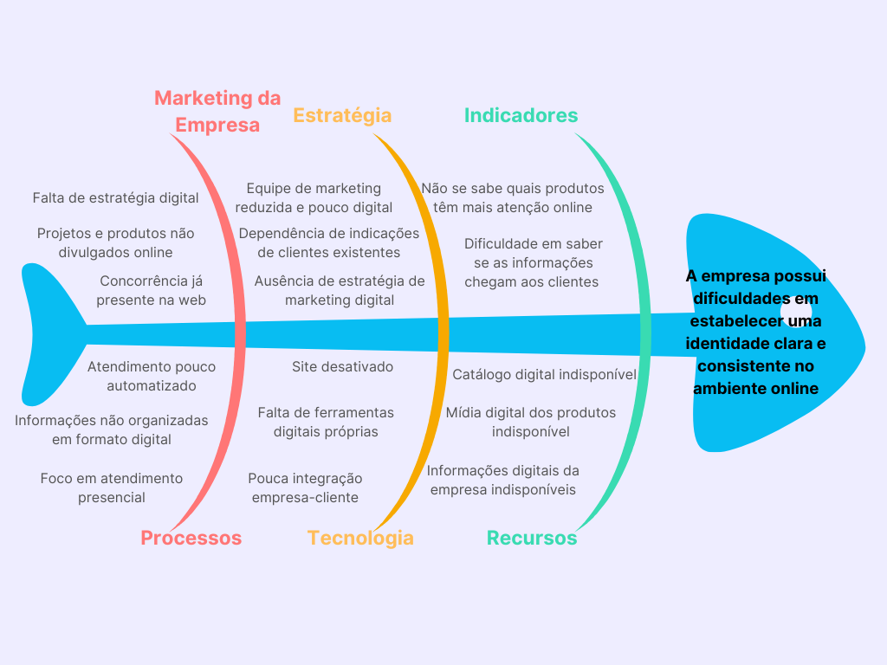

| Versão | Data | Descrição  | Autor    |   
| :-----: | :----: | :----------: | :------------: |
| 1.0 | 01/09/2025 | Versão inicial | [Yasmin Dayrell](https://github.com/YasminDayrell), [Guilherme Flyan](https://github.com/GFlyan)|
| 1.1 | 05/09/2025 | Correção após orientações | [Yasmin Dayrell](https://github.com/YasminDayrell), [Guilherme Flyan](https://github.com/GFlyan)|
| 1.2 | 08/09/2025 | Versão corrigida após devolutiva | Todos os membros da equipe|
| 1.3 | 13/09/2025 | Inserção dos itens 2.3 até 6.1 | [Yasmin Dayrell](https://github.com/YasminDayrell), [Guilherme Flyan](https://github.com/GFlyan) [Marjorie Mitzi](https://github.com/Marjoriemitzi) |
| 1.4 | 13/09/2025 | Inserção, estilização e formatação no gitpages | [João Vitor Merlin](https://github.com/jvopBR) |

# 1.1 Introdução ao Negócio e Contexto

A **Nihon Automação** atua no mercado desde 1995, inicialmente com foco na venda de software e assistência técnica para comércios e supermercados, em um contexto de baixa concorrência na área de tecnologia.  

Com as mudanças no mercado, a empresa direcionou suas atividades para a venda de produtos voltados ao setor supermercadista, tendo como principais clientes grandes redes de supermercados, padarias, açougues e comércios de alimentos, como o **Dia a Dia** e o **Super Adega**.  

A empresa destaca que sua principal atividade é a venda de grandes projetos, que consiste na comercialização de diversos produtos para um mesmo cliente em uma única venda. Nessa modalidade, o vendedor não se limita a oferecer produtos, mas também fornece soluções e compartilha seu conhecimento especializado no setor.  

Essa transformação demandou um processo de modernização, que chegou a ocorrer por meio de um site institucional. Contudo, o site foi posteriormente desativado por não refletir mais o escopo da empresa. Com isso, a Nihon deixou de acompanhar o comportamento digital das novas gerações, mantendo sua atuação quase que exclusivamente em vendas presenciais e em indicações de clientes já existentes.  

Atualmente, a empresa enfrenta dificuldades relacionadas à falta de uma estratégia clara de atuação no ambiente digital, o que compromete sua visibilidade e limita a inserção de novos clientes em um mercado cada vez mais competitivo e modernizado.  

---

# 1.2 Identificação da Oportunidade ou Problema

A Nihon não consegue se posicionar e atuar no ambiente digital, o que prejudica sua visibilidade e competitividade no mercado. Essa limitação gera impactos diretos tanto no relacionamento com clientes antigos quanto na atração de novos públicos.  

**Principais pontos críticos identificados:**

- **Clientes antigos desinformados:** muitos desconhecem parte do portfólio da empresa e deixam de adquirir produtos por falta de clareza na comunicação.  

- **Baixa captação de novos clientes:** a ausência de presença digital dificulta que potenciais clientes encontrem a empresa por meio online. 
 
- **Desvantagem frente à concorrência:** empresas concorrentes já atuam com estratégias digitais modernas, o que torna a Nihon menos competitiva.  

Portanto, existe uma oportunidade em criar uma presença digital estruturada e estratégica, que permita à Nihon comunicar sua identidade, apresentar seus produtos de forma clara e estabelecer novos canais de relacionamento e prospecção de clientes.  

---

# 1.3 Desafios do Projeto

O projeto apresenta como principal desafio o nível técnico da equipe, visto que a equipe responsável pelo desenvolvimento do projeto é formada por estudantes, que não possuem muita experiência profissional no desenvolvimento de software, o que pode acabar afetando nos prazos de entrega do produto.  

Além disso, o projeto exige que a solução seja constantemente atualizada e organizada de maneira prática, garantindo que os administradores da empresa consigam gerenciar as informações.  

Outro desafio relevante é fazer com que o produto consiga agregar valor à empresa, assegurando que a identidade da Nihon seja transmitida de forma consistente no ambiente digital e gere confiança tanto em clientes já consolidados quanto em potenciais novos parceiros.  

---

# 1.4 Segmentação de Clientes

A Nihon cita que seus principais clientes no momento são os donos ou representantes de supermercados, padarias e açougues. A maioria são clientes que já conhecem a empresa ou foram indicados por alguém que já conhecia, sendo estes adultos mais velhos.  

Também há o público mais jovem que usa a internet como principal mecanismo de busca para novas compras. Por último, a própria equipe da Nihon irá interagir com o site de forma a atualizá-lo de acordo com o estoque da empresa.  

**Resumo de clientes:**

- **Equipe administrativa da Nihon (20-60 anos):** Funcionários da Nihon que terão acesso como administradores para atualizar o catálogo e corrigir estoque. Todos têm experiência média-alta com ferramentas de software, buscando poder atualizar as informações sobre produtos e projetos de forma eficaz.  

- **Donos/representantes de supermercados, padarias, açougues e comércios de alimentos (40-65 anos):** Clientes da Nihon, em geral mais velhos, que preferem contato humano e podem não ter tanta experiência com ferramentas digitais. Buscam uma experiência intuitiva e simples.  

- **Potenciais novos clientes jovens (26-38 anos):** Empreendedores que acabaram de abrir seu primeiro negócio e estão em busca de equipamentos para sua empresa. Utilizam a internet como principal meio de busca, são experientes com ferramentas de software e buscam uma experiência rápida e dinâmica.  
